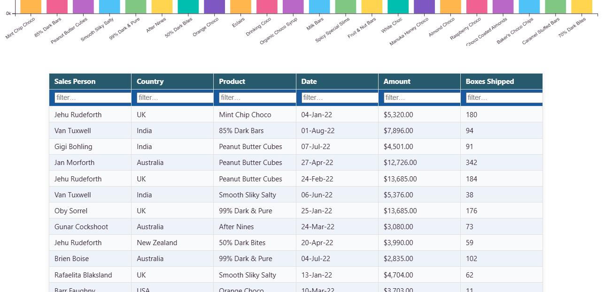
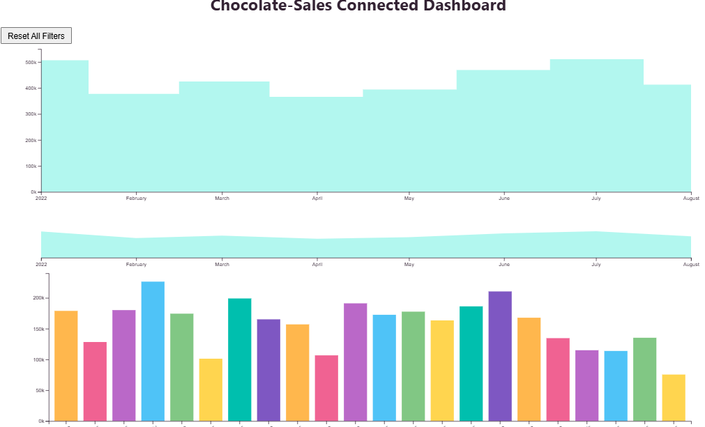

# CSE468-Connected-Multi-View-Dashboard

Interactive Chocolate Sales Visualization

## Overview

An interactive multi-view dashboard developed for the Information Visualization course using D3.js. The dashboard enables coordinated exploration of chocolate sales data through linked visualizations and interactive filtering.

## Features

* Interactive data table with sorting and filtering
* Time series area chart with brushing
* Stacked bar chart for category analysis
* Cross-filtering and linked interactions
* Real-time coordinated updates between views
* Smooth transitions and responsive layout
* Reset functionality for clearing selections

## Repository Structure

```text id="l08pdq"
.
├── data/          # Dataset files
├── src/           # JavaScript source code
├── README.md
├── image.png      # Dashboard screenshot
├── image2.png     # Additional screenshot
├── index.html
└── styles.css
```

## Dashboard Components

### Interactive Data Table

Provides:

* Sorting on all columns
* Filtering capabilities
* Pagination for large datasets
* Row selection with visual feedback

Selected rows are synchronized with the charts.

### Time Series Area Chart

Displays monthly sales trends using a focus+context layout.

Features:

* Brushing for time-range selection
* Dynamic filtering of other views
* Smooth updates during interaction

### Stacked Bar Chart

Visualizes sales grouped by category.

Features:

* Category selection
* Highlighting and filtering
* Coordinated interaction with the table and area chart

## Coordinated Views

All components are connected through shared state and cross-filtering.

Interactions in one view automatically update:

* The data table
* The area chart
* The stacked bar chart

This enables interactive exploration from multiple perspectives.

## D3.js Concepts

The project demonstrates:

* Brushing and linking
* Event handling
* Coordinated multiple views
* Data-driven updates
* Animated transitions
* Responsive visualization design

## Screenshots

### Dashboard Overview



### Interactive Views



## Running

Open the dashboard in a web browser:

```bash id="tztk8g"
index.html
```

or start a local server:

```bash id="o9f88j"
python -m http.server
```

and navigate to:

```text id="d1t4es"
http://localhost:8000
```

## Main Files

### src/

Contains the JavaScript implementation of:

* Data loading
* Chart rendering
* Event handling
* State management
* Cross-view coordination

### data/

Contains the chocolate sales dataset used by the dashboard.

## Technologies

* D3.js
* HTML
* CSS
* JavaScript

## Course Information

**Course:** CSE468 Information Visualization

